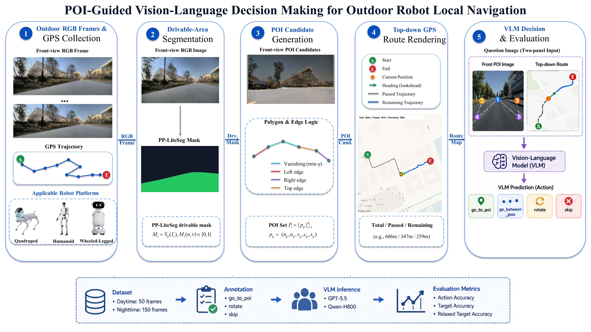
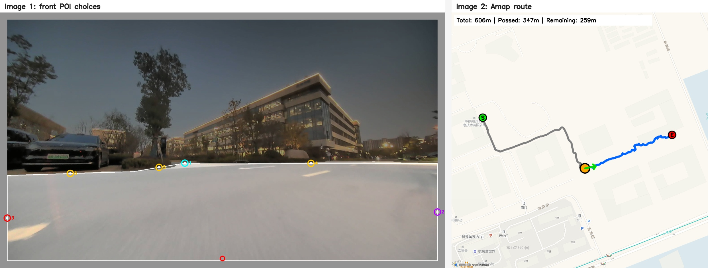
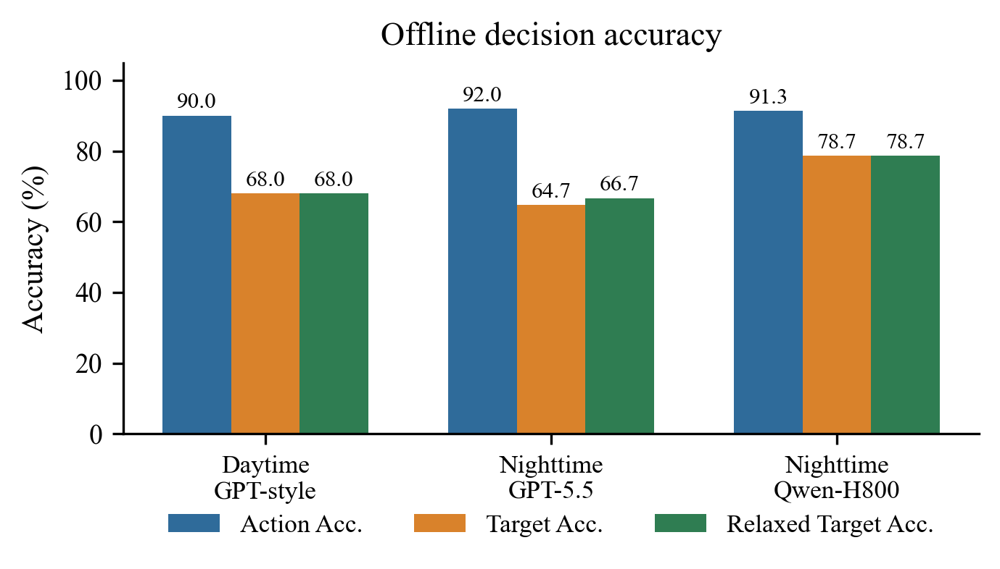

# POI-Guided Vision-Language Decision Making for Outdoor Robot Local Navigation

An interpretable perception-to-decision interface that turns drivable-area
geometry and route context into visual, structured VLM actions.

Videos, the narrated PPT presentation, and other visual demonstrations are
available on the [Project Page](https://tangyipeng100.github.io/POI_VLM/).

POI-VLM is a compact interface for route-aware local decisions in outdoor
robotics. A drivable-area mask becomes a small set of numbered polygon POIs;
a route-progress cue adds direction; a vision-language model returns one
structured action that can be inspected by a person and scored frame by frame.

## Visual overview

<p align="center">
  
</p>

<p align="center">
  
  
</p>

## Contents

- [Night-150 dataset note](dataset/night_150/README.md): the coordinate-free metadata slice and preview images.
- [Annotation tool guide](annotation_app/README.md): the local browser labeler.

## What is included

- `poi_core/`: polygon extraction, edge classification, vanishing-point and priority-aware candidate generation.
- `examples/`: an offline POI overlay example, bundled input assets, and a generated result image/JSON.
- `inference_bridge.py`: a provider-neutral bridge for sending a composed question image to an OpenAI-compatible VLM endpoint.
- `tests/`: focused tests for the reusable core and inference bridge.
- `dataset/night_150/`: 150 ordered metadata records, sanitized decisions, and 18 preview images. No coordinates or provider map tiles are included.
- `annotation_app/` and `annotation_server.py`: a local-only browser labeler with POI, rotate, skip, confidence, notes, sample navigation, and CSV export.

## Runnable examples

Install the small Python package first if OpenCV/NumPy are not already
available:

```powershell
python -m pip install -e .
```

### 1. Generate numbered POIs

The bundled example uses a front frame and drivable-area mask. It is offline
and needs no API key:

```powershell
python examples/generate_poi_example.py
```

Outputs:

- `examples/output/poi_overlay.jpg`: the front frame with the polygon and numbered POIs.
- `examples/output/poi_result.json`: the polygon, edge classes, and POI pixel coordinates.

Replace the inputs when testing another frame:

```powershell
python examples/generate_poi_example.py `
  --image path\to\front.jpg `
  --mask path\to\drivable_mask.png `
  --output output\my_poi_overlay.jpg
```

### 2. VLM inference bridge

`inference_bridge.py` sends one composed front/map image, or two separate
front/map images, to an OpenAI-compatible endpoint. It supports Chat
Completions and Responses-shaped APIs, retries transient failures, and only
reads credentials from an environment variable. The bridge returns only the
normalized `action`, `poi_number`, and `reason` fields; raw provider responses
are not written.

Inspect the request without making a network call:

```powershell
python inference_bridge.py `
  --image assets/question.png `
  --model your-vision-model `
  --dry-run
```

To mirror the two-image experiment input, pass the front POI image first and
the top-down route image second:

```powershell
python inference_bridge.py `
  --image examples/assets/sample_front_frame.jpg assets/question.png `
  --model your-vision-model `
  --dry-run
```

Run a real Chat Completions request:

```powershell
$env:VLM_API_KEY = "your-key"
$env:VLM_MODEL = "your-vision-model"
$env:VLM_BASE_URL = "https://api.openai.com/v1"
python inference_bridge.py `
  --image assets/question.png `
  --output output\decision.json
```

For a local vLLM or other compatible server, change only the base URL:

```powershell
$env:VLM_API_KEY = "local-placeholder"
python inference_bridge.py `
  --base-url "http://127.0.0.1:8000/v1" `
  --model your-local-vlm `
  --image assets/question.png
```

Responses API shape:

```powershell
python inference_bridge.py `
  --wire responses `
  --api-url "https://api.openai.com/v1/responses" `
  --model your-vision-model `
  --image assets/question.png
```

## Annotation quick start

From this directory, run the local labeler:

```powershell
python annotation_server.py
```

Open `http://127.0.0.1:8765/`. The default dataset is the bundled preview
slice. To review another compatible local dataset, pass
`--dataset-dir path\to\dataset`. The server writes annotation files next to
that dataset; no network or API key is required.

## Evaluation snapshot

The current paper snapshot reports 150 night frames: GPT-5.5 action accuracy
`138/150` and Qwen-H800 action accuracy `137/150`. Strict target agreement is
`97/150` and `118/150`, respectively. These are offline frame-level results,
not closed-loop navigation or a safety guarantee.

## Release boundary

The package does not publish API keys, raw recordings, exact GPS or route
coordinates, provider-owned map imagery, raw VLM payloads, internal chats,
patent material, or the original segmentation training set. The included
images and videos are reviewable evidence; confirm consent and third-party
image rights before hosting them publicly. The paper link is intentionally a
living placeholder until the final publication is available.
